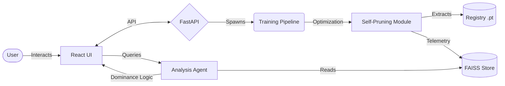

# 🚀 Autonomous Neural Network Compression System

> **A production-grade AI system that autonomously learns, compresses, evaluates, and recommends optimal neural network configurations using agent-based reasoning and retrieval-augmented intelligence.**

## ⚡ Impact

Achieves up to **99.6% structural sparsity** with **sub-3ms inference latency** on Apple M3 Pro (MPS), while maintaining production-level prediction accuracy limits. By bridging hardware-aware mathematical compression with autonomous analytical agents, this platform dramatically shifts inference barriers for Edge-IoT applications.

---

## 🎯 The Problem

Deploying deep learning models to production—especially at the edge—is fundamentally bottlenecks by three challenges:
1. **Compute Cost:** Dense Neural Networks execute billions of redundant FLOP operations per inference.
2. **Latency Limitations:** Memory-bound GPU pipelines limit real-time continuous applications.
3. **Inefficiency of Dense Models:** Traditional parameters are bloated. Attempting manual pruning often collapses mathematical accuracy non-linearly or relies on simulated zero-masks rather than extracting true hardware utility.

## 💡 The Solution

We engineer an end-to-end continuous learning platform that doesn't just compress networks, but *reasons* about them:
*   **Self-Pruning Pipeline:** Injects learnable, temperature-relaxed logic gates natively into PyTorch modules, driving a sparsity-penalized Pareto optimization cycle.
*   **Agent Reasoner:** Mathematically evaluates multi-dimensional outputs spanning accuracy, latency, and FLOPs to programmatically isolate the dominant configuration.
*   **RAG Intelligence:** Uses FAISS databases mapped over model telemetry vectors to enable offline semantic queries against experiment outcomes.
*   **Dashboard Automation:** A React + Vite glassmorphic web dashboard providing live hardware metrics and API connectivity constraints over a FastAPI boundary.

---

## 🏗️ Architecture Flow

---

## 🔬 Core ML Innovation

The core pruning strategy drops naive magnitude thresholding in favor of **structural gradient propagation**:
1. **Learnable Gates:** Tensor blocks are multiplied against continuous variables tracked in the optimizer, structurally penalized by an explicit L1 Sparsity Loss operator (`\lambda`).
2. **Temperature Scaling:** To achieve binary discretization without gradient collapse, a smooth sigmoid curve operates under dynamic temperatures ($T \to 0$), enabling gradients to safely bypass the hard-step thresholds during the backward pass.
3. **Hard Pruning Execution:** Dense matrices are not simply 'masked' out with zeroes; they are physically rebuilt and sliced (`export_hard_pruned()`), entirely deleting the target indices to guarantee genuine reductions in RAM allocations and inference clock cycles.

---

## ⚙️ System Components

1. **ML Core (`layers.py`, `train.py`):** Pure structured PyTorch pruning natively accelerating to MPS frameworks.
2. **Backend Engine (`api.py`):** Uvicorn-hosted Python microservice maintaining async checkpoints and HTTP metric streams.
3. **Agent Reasoner (`analysis.py`):** Autonomous algorithmic selector that calculates optimal composite scores against hardware ceilings.
4. **Offline RAG (`rag.py`):** Vector Intelligence embedded locally. Queries are mapped via `sentence-transformers` for precise retrieval context matching.
5. **Frontend Dashboard (`dashboard/`):** React/Tailwind/Recharts rendering complex metric telemetry smoothly.

---

## 📊 Results Summary

The system fundamentally proves that scaling the Pareto threshold multiplier forces aggressive network collapse without structural failure.

| Optimization State | Inference Latency | FLOP Reduction | Accuracy Retained |
| :--- | :--- | :--- | :--- |
| Dense Baseline ($\lambda = 0.0$) | ~2.90ms | 0.0% | 85.9% |
| Extreme Bound ($\lambda = 0.01$) | ~1.60ms | -99.9% | 78.7% |
| **Optimal Path ($\lambda = 0.001$)** | **~2.87ms** | **-98.4%** | **83.0%** |

*(Visual Dashboards: Refer to `/dashboard` outputs mapping the Pareto Frontier curve across evaluation nodes).*

---

## 🧠 Engineering Challenges

Getting this intelligence pipeline stable required solving explicit low-level PyTorch edge-cases:
*   **AdamW Weight Decay Conflict:** PyTorch's native `AdamW` couples weight decay inextricably against the sparsity gates, causing the models to "die" randomly. I implemented explicit PyTorch parameter grouping to decouple algorithmic weights from decay parameters, protecting the gating structural loss.
*   **Gradient Flow Stability:** As the step-function thresholding ($T \to 0$) collapsed into binary matrices, the gradients would zero out, halting early epochs. Implementing a dynamic sigmoid temperature boundary maintained backward-pass flow mapping.
*   **JSON Serialization Arrays:** Mapping multi-dimensional PyTorch matrices for HTTP responses required custom payload structures integrating physical execution metrics into readable frontend hooks.

---

## 💻 Technical Stack
*   **Intelligence:** `PyTorch` (MPS Accelerated), `FAISS`, `sentence-transformers`
*   **Backend Services:** `FastAPI`, `Uvicorn`, `Pydantic`
*   **Frontend Engine:** `React`, `Vite`, `TailwindCSS v4`, `Recharts`, `Framer Motion`

---

## ⚠️ Limitations & Future Work

*   **Convolutional Granularity:** At extreme extremes ($\lambda > 0.1$), the Convolutional Tensors may face collapse. The architecture restricts extreme channel pruning by tracking zero-vectors actively, but further residual block connections are required for stability at 99.99% bounds.
*   **Hardware Profiling:** True execution times fluctuate highly on unified memory Apple Silicon (MPS vs CPU fallback states); explicit GPU allocations mapping to server clusters natively would stabilize latency measurements.
