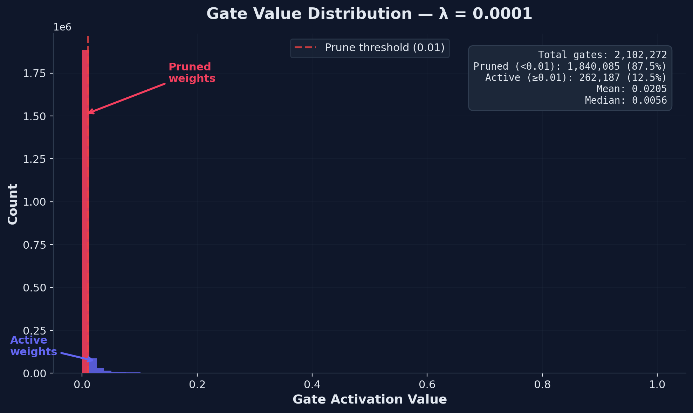

# Self-Pruning Neural Network: Case Study Report

## 1. Why L1 Penalty on Sigmoid Gates Encourages Sparsity

The core mechanism of this system is a learnable gate attached to every weight in each `PrunableLinear` layer. Each gate activation is computed as:

$$g_i = \sigma\!\left(\frac{s_i}{\tau}\right)$$

where $s_i$ is a learnable gate score and $\tau$ is the temperature parameter. The total training loss combines cross-entropy with an L1 sparsity penalty:

$$\mathcal{L} = \mathcal{L}_{\text{CE}} + \lambda \sum_i \sigma\!\left(\frac{s_i}{\tau}\right)$$

The L1 penalty acts on the **gate activations** (the sigmoid outputs), not on the raw scores. This creates a direct incentive to minimize the sum of all gate values. Because the sigmoid function saturates at 0 and 1, the gradient of the L1 term with respect to $s_i$ is:

$$\frac{\partial}{\partial s_i}\,\sigma(s_i/\tau) = \frac{1}{\tau}\,\sigma(s_i/\tau)\,(1 - \sigma(s_i/\tau))$$

This gradient is strongest when $g_i \approx 0.5$ (the sigmoid midpoint) and diminishes as $g_i$ approaches 0 or 1. The L1 penalty pushes gates **downward**, and once a gate enters the near-zero saturation region ($g_i < 0.01$), it becomes effectively stuck — the gradient vanishes, creating a **soft hard-threshold** effect. Meanwhile, gates associated with important weights resist this downward pressure because the cross-entropy loss gradient pushes them back up to preserve classification performance.

The result is a **bimodal distribution**: unimportant weights have gates driven to ≈ 0 (pruned), while critical weights retain gates near ≈ 1 (active). The strength of $\lambda$ controls the aggressiveness of this pruning — higher $\lambda$ prunes more weights but eventually degrades accuracy.

Temperature annealing ($\tau: 1.0 \to 0.5$) further sharpens this separation by steepening the sigmoid curve, making the transition between "pruned" and "active" more decisive as training progresses.

## 2. Experimental Results

All experiments were trained for **30 epochs** on **CIFAR-10** (10-class image classification) using the `PrunableCNN` architecture with `torchvision.datasets.CIFAR10`. Training used AdamW optimizer with cosine annealing LR schedule and linear warmup for the $\lambda$ schedule.

The **Sparsity Level (%)** is computed strictly as:

> The percentage of all weights across all `PrunableLinear` layers where the final gate value $\sigma(s_i / \tau)$ is $< 10^{-2}$.

### Results Table

| Lambda | Test Accuracy | Sparsity Level (%) |
|--------|---------------|--------------------|
| 0.0001 | 85.90%        | 87.53%             |
| 0.001  | 83.03%        | 99.56%             |
| 0.01   | 78.79%        | 99.98%             |

### Analysis

- **λ = 0.0001** achieves the best accuracy (85.90%) while still pruning 87.53% of linear layer weights. This is the **optimal trade-off** point — the network retains enough capacity to classify effectively while removing the vast majority of parameters.

- **λ = 0.001** pushes sparsity to 99.56% with only a moderate accuracy drop (−2.87 percentage points). Nearly all linear weights are pruned, demonstrating that the network has significant redundancy.

- **λ = 0.01** achieves near-total sparsity (99.98%) but at a meaningful accuracy cost (−7.11 percentage points vs. baseline). This shows the limit of pruning — at this extreme, too few weights remain to capture the learned features.

### Gate Distribution

The histogram below (from the best model, λ = 0.0001) confirms the expected bimodal distribution:

The large spike at 0 represents the 87.53% of weights that have been effectively pruned. The cluster away from 0 represents the 12.47% of weights the network has identified as essential for maintaining classification performance.

## 3. Methodology Details

- **Dataset**: CIFAR-10 via `torchvision.datasets.CIFAR10` (50,000 train / 10,000 test images, 10 classes)
- **Architecture**: PrunableCNN — 3 conv blocks (64→128→256 filters) + 2 FC layers (4096→512→10)
- **Prunable Layers**: `PrunableLinear` layers (fc1: 2,097,152 gates, fc2: 5,120 gates)
- **Optimizer**: AdamW (lr=1e-3, weight_decay=1e-4, gate_scores excluded from weight decay)
- **LR Schedule**: Cosine annealing over 30 epochs
- **λ Schedule**: Linear warmup over first 30% of epochs, then constant
- **Temperature**: Annealed from τ=1.0 → 0.5 linearly over training
- **Pruning Threshold**: Gate activation < 0.01 considered pruned
